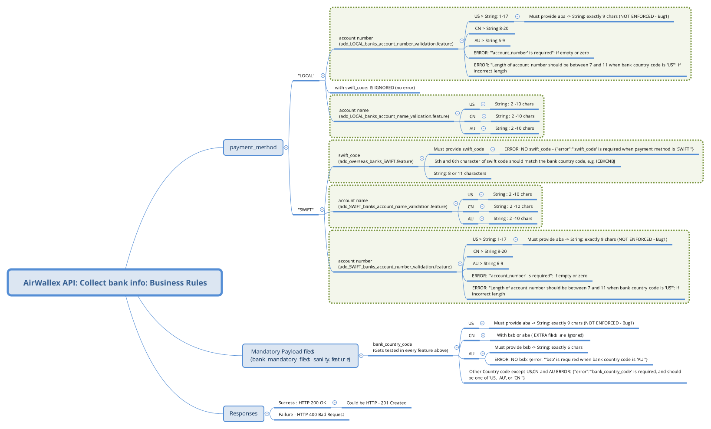

# Running from command line

```sh
cd /path/to/qa-api-test
mvn clean test -Dcucumber.options="--tags ~@ignore"
```
By default this executes the test on http://preview.airwallex.com:30001
To change it to demo ( http://preview.airwallex.com:30001) run
```sh
mvn clean test -Dkarate.env=demo
```
The generated HTML reports for test runs can be found under 
`qa-api-test/target/surefire-reports`

# Business Requirement Analysis:



### Requires Clarifications
1. Inconsistency in the requirement of valid account number length for US:
As per requirements document, for US, the account numbers with length 1 - 17 characters are valid. 
Although API is implemented to adhere to this rule, are single digit account numbers valid in real life? 
But the error message API speaks of a different length requirement.
 `Length of account_number should be between 7 and 11 when bank_country_code is 'US'`
Which appears to be more correct.

2. For account_number = " \t \r \n" (whitespaces) or "~!@$%^&*_+|:><?" (special characters) should NOT pass the validation but it does. What is the point of allowing this? Are such account numbers any useful?
Shouldn't we have at least few alphanumeric characters along with whitespaces and special characters for valid account numbers?

 # Bugs
 I have created cucumber tags for each bug found. To reproduce any bug please run  tag `@bug` followed by its number in the list.
 E.g. To reproduce bug no. 3 run
 ```sh
 mvn test -Dcucumber.options="--tags @bug3"
 ```
 #### Bugs Found
 1. Providing `aba` is NOT enforced for `bank_country_code: "US"` in both payment methods (LOCAL and SWIFT).
 2. For `bank_country_code:"CN"`, maximum length of `account_number` is only `9` characters (should be `20` as per requirements)
 3. For `bank_country_code:"CN"`, minimum length of `account_number` is only `7` characters (should be `8` as per requirements)
 4. For `bank_country_code:"US"`, `account_number:"0"` is saved Successfully. It doesn't appear to be valid account_number.
 5. swift_code of length `9` and `10` should NOT be saved successfully. As per requirements, valid swift_code is either `8 or 11` characters long.
 6. Numeric account_name like `123456789` should NOT be saved successfully. Account name is always a string.   
#### Observations
For AU and CN, `account_number:"0"` returns `{"error":"Length of account_number should be between 7 and 11 when bank_country_code is 'US'"}`. Since this equivalent to no account number at all, should we return `{"error":"'account_number' is required"}` instead?
## Improvements/Suggestions
 1. The convention is to return HTTP `201 - Created` when a resource gets created on the server. Reference https://developer.mozilla.org/en-US/docs/Web/HTTP/Status/201. Consider returning the same after a successful POST of the account information as account resource gets created in this case.

